📊 Data Leverager - Power BI ETL Project

---

🚀 Project Overview

This project demonstrates a complete ETL (Extract, Transform, Load) workflow using Power BI Power Query.

The main objective was to combine multiple monthly sales files and employee data, clean messy records, create useful business attributes, merge datasets, perform aggregations, and prepare a clean dataset ready for analysis and reporting.

🎯 Project Goals

✅ Import multiple Excel files

✅ Clean inconsistent and messy data

✅ Append monthly sales datasets

✅ Merge employee information

✅ Create custom and conditional columns

✅ Perform business aggregations

✅ Build a structured ETL workflow

---

🛠️ Tools Used

Tool| Purpose
Power BI Desktop| Data Transformation & ETL
Power Query Editor| Data Cleaning
Microsoft Excel| Source Files
GitHub| Project Documentation

---

📂 Dataset Used

🛒 Sales Dataset

- January Sales
- February Sales
- March Sales
- April Sales

👨‍💼 Employee Dataset

- Employee ID
- Employee Name
- Department
- Region
- Join Date

---

📸 Project Screenshots & Transformations

---

🧹 Clean Sales Data - Part 1

File: 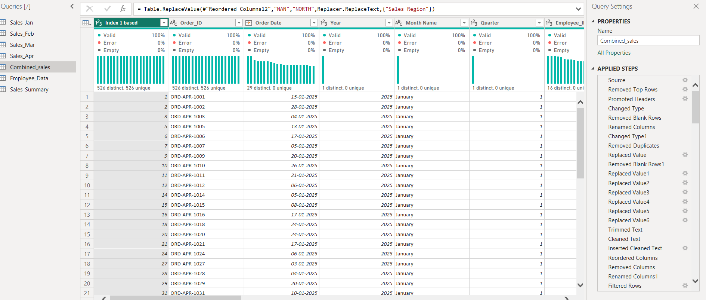

🔍 Description

Initial cleaning performed on the appended sales dataset.

⚙️ Transformations

- Removed unnecessary rows
- Promoted headers
- Changed data types
- Removed null values
- Standardized text values

---

🧹 Clean Sales Data - Part 2

File: 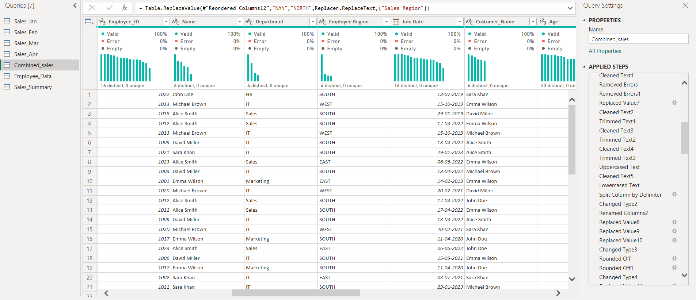

🔍 Description

Improved overall data quality and consistency.

⚙️ Transformations

- Text Trim
- Text Clean
- Replace Values
- Standardized Region Names
- Removed Duplicates

---

🧹 Clean Sales Data - Part 3

File: 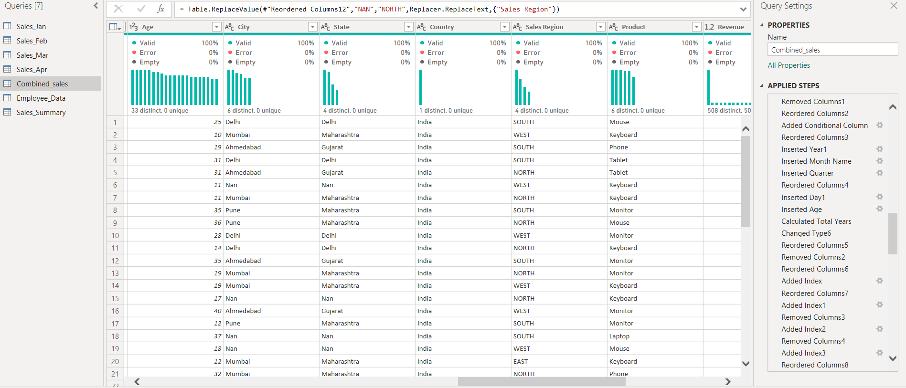

🔍 Description

Created additional business-related columns.

⚙️ Transformations

- Extracted Year
- Extracted Month Name
- Extracted Quarter
- Corrected Data Types

---

🧹 Clean Sales Data - Part 4

File: 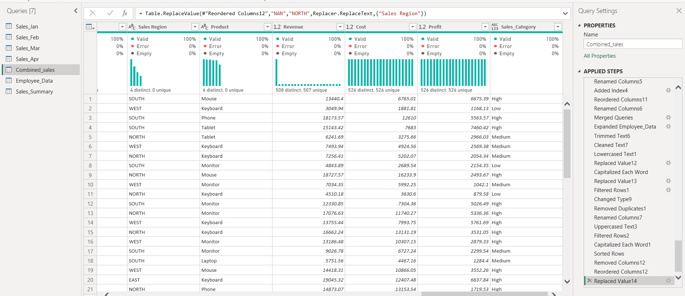

🔍 Description

Final validation and preparation before merging.

⚙️ Transformations

- Reordered Columns
- Data Validation
- Error Checks
- Consistency Verification

---

📋 Applied Steps

File: 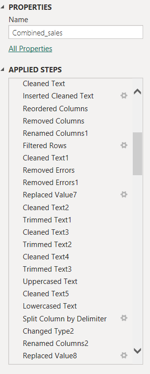

🔍 Description

Displays the complete sequence of Power Query transformations.

⚙️ Functions Used

- Changed Type
- Remove Columns
- Rename Columns
- Trim Text
- Clean Text
- Replace Values
- Add Columns
- Reorder Columns
- Extract Date Components

---

🔗 Merge Queries

File: 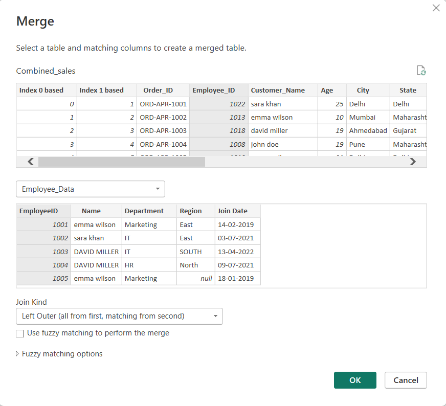

🔍 Description

Merged Sales Data with Employee Data using Employee ID.

⚙️ Functions Used

- Merge Queries
- Left Outer Join
- Expand Columns

➕ Columns Added

- Employee Name
- Department
- Employee Region
- Join Date

---

🧮 Custom Column

File: 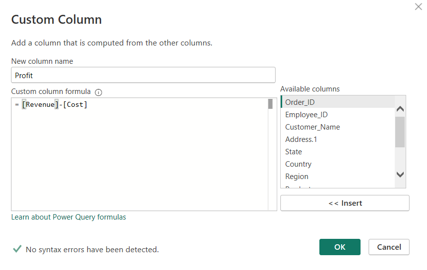

🔍 Description

Created custom business logic columns.

⚙️ Functions Used

- Add Custom Column
- Conditional Expressions
- Business Rule Calculations

---

🎯 Conditional Column

File: 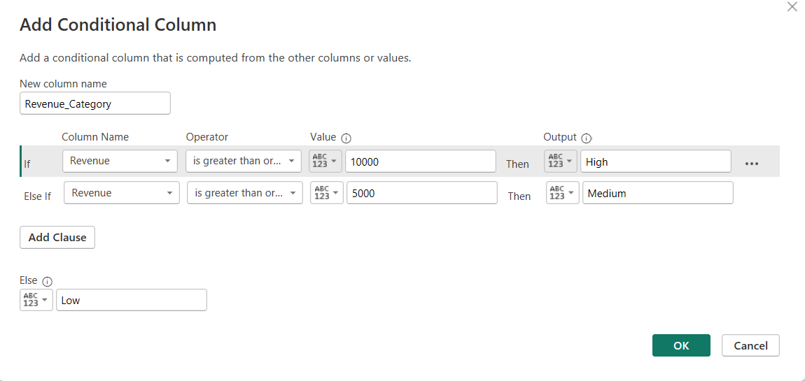

🔍 Description

Created sales categories using IF-ELSE logic.

📈 Categories

- High Revenue
- Medium Revenue
- Low Revenue

---

📊 Group By Query

File: 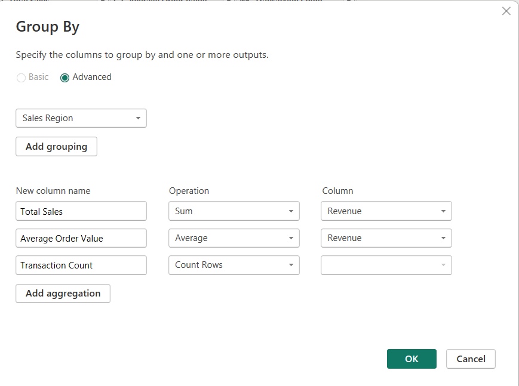

🔍 Description

Used aggregation techniques to summarize sales performance.

📌 Metrics Calculated

- Total Sales
- Average Order Value
- Transaction Count

---

📈 Group By Output

File: 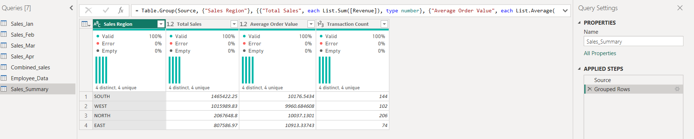

🔍 Description

Final summarized business table after aggregation.

💡 Insights Generated

- Regional Sales Performance
- Average Order Trends
- Transaction Volume Analysis

---

🔄 Query Dependencies

File: 
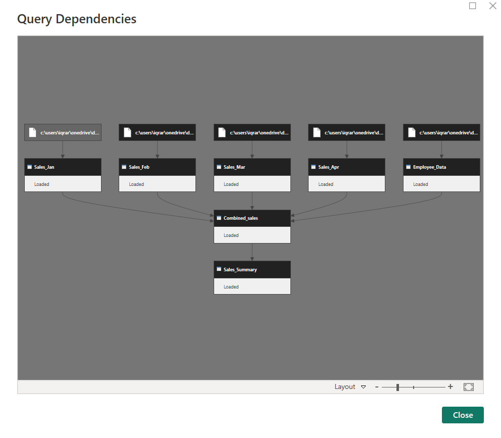

🔍 Description

Visual representation of relationships between Power Query objects.

🎯 Purpose

- Understand ETL Workflow
- Track Dependencies
- Visualize Data Lineage

---

🔄 ETL Workflow

Import Files
      ↓
Append Sales Data
      ↓
Clean Data
      ↓
Create Custom Columns
      ↓
Create Conditional Columns
      ↓
Merge Employee Data
      ↓
Perform Aggregations
      ↓
Validate Results
      ↓
Load Clean Dataset

---

⭐ Key Power Query Features Demonstrated

- Append Queries
- Merge Queries
- Data Cleaning
- Data Transformation
- Custom Columns
- Conditional Columns
- Group By
- Query Dependencies
- Data Validation

---

🎓 Learning Outcomes

Through this project, I learned:

✅ ETL Process in Power BI

✅ Power Query Transformations

✅ Data Cleaning Techniques

✅ Merge & Append Operations

✅ Business Aggregations

✅ Query Dependency Management

✅ GitHub Project Documentation

---

🏁 Conclusion

This project successfully demonstrates an end-to-end ETL workflow using Power BI Power Query.

Multiple monthly sales files were consolidated, cleaned, enriched with employee information, transformed into a structured dataset, and prepared for analysis.

The project showcases practical data preparation skills commonly used in real-world Business Intelligence and Analytics projects.

---

🔄 ETL & Data Cleaning Project
